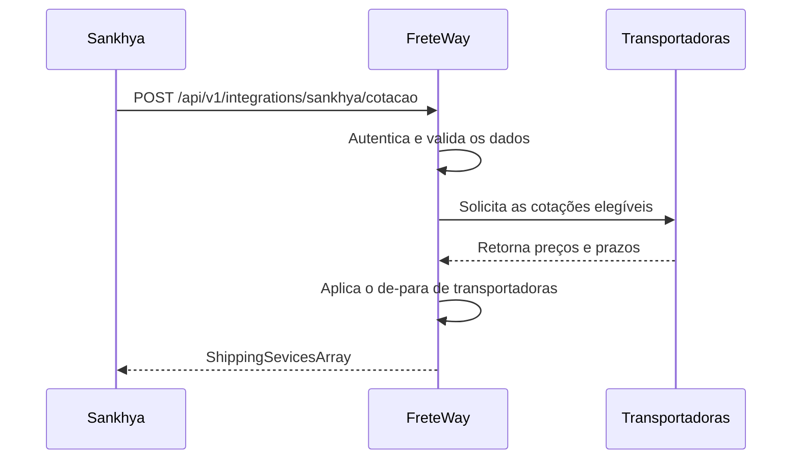

# API de cotação de frete — Sankhya

Esta API permite que o Sankhya solicite ao **FreteWay** cotações de frete para
um pedido ou nota. O FreteWay consulta as transportadoras elegíveis, normaliza
os resultados e devolve preço, prazo e o código do parceiro correspondente no
Sankhya.

## Visão geral do processo



1. O Sankhya envia os dados da carga, origem, destino, empresa e nota.
2. O FreteWay valida a chave de acesso e a empresa informada.
3. O motor consulta as transportadoras ativas e elegíveis.
4. O FreteWay relaciona cada transportadora ao seu `CODPARC` no Sankhya.
5. O Sankhya recebe uma lista com preço, prazo e eventuais erros por opção.

## Endpoint

```http
POST https://modial-fretes.com.br/api/v1/integrations/sankhya/cotacao
Content-Type: application/json
X-API-Key: <API_KEY>
```

O ambiente deve fornecer uma chave exclusiva no header `X-API-Key`. A chave
real não deve ser gravada no código-fonte ou em arquivos versionados.

## Corpo da requisição

```json
{
  "NUNOTA": 21259,
  "CODEMP": 1,
  "CepOrigem": "01001-000",
  "CepDestino": "30110-000",
  "VlrNota": 6781.00,
  "Volumes": [
    {
      "Quantidade": 2,
      "Peso": 12.5,
      "Altura": 30,
      "Largura": 40,
      "Comprimento": 50
    }
  ]
}
```

### Campos principais

| Campo | Tipo | Obrigatório | Descrição |
|---|---|:---:|---|
| `NUNOTA` | número ou texto | Sim | Número único da nota ou pedido no Sankhya. |
| `CODEMP` | número ou texto | Sim | Código da empresa vinculada no FreteWay. |
| `CepOrigem` | texto | Sim | CEP de origem, com ou sem pontuação. |
| `CepDestino` | texto | Sim | CEP de destino, com ou sem pontuação. |
| `VlrNota` | número positivo | Sim | Valor total da mercadoria. |
| `Volumes` | array | Sim | Um ou mais grupos de volumes da carga. |

### Campos de cada volume

| Campo | Tipo | Obrigatório | Descrição |
|---|---|:---:|---|
| `Quantidade` | inteiro positivo | Não | Quantidade de volumes iguais. O padrão é `1`. |
| `Peso` | número positivo | Sim | Peso unitário, em quilogramas. |
| `Altura` | número positivo | Condicional | Altura unitária, em centímetros. |
| `Largura` | número positivo | Condicional | Largura unitária, em centímetros. |
| `Comprimento` | número positivo | Condicional | Comprimento unitário, em centímetros. |
| `VolumeM3` | número positivo | Condicional | Cubagem unitária, em metros cúbicos. |

Cada item deve informar `VolumeM3` **ou** o conjunto completo `Altura`,
`Largura` e `Comprimento`. O FreteWay multiplica peso e cubagem pela quantidade
antes de cotar.

Também são aceitos os nomes internos da API, como `numero_pedido`,
`empresa_sankhya_id`, `valor_mercadoria`, `origem`, `destino` e `itens`.

## Resposta de sucesso

Uma requisição válida retorna HTTP `200`:

```json
{
  "ShippingSevicesArray": [
    {
      "ServiceCode": "04014",
      "ServiceDescription": "SEDEX",
      "Carrier": "Correios",
      "CarrierCode": "CORREIOS",
      "CarrierCnpj": "12345678000190",
      "CodParcTransp": 1234,
      "ShippingPrice": "89.90",
      "DeliveryTime": "3",
      "Error": false,
      "Msg": ""
    }
  ]
}
```

> `ShippingSevicesArray` mantém propositalmente a grafia do contrato legado
> compatível com o parser atual do Sankhya.

### Campos da resposta

| Campo | Tipo | Descrição |
|---|---|---|
| `ServiceCode` | texto | Código do serviço definido no de-para. |
| `ServiceDescription` | texto | Descrição do serviço ou da transportadora. |
| `Carrier` | texto | Nome da transportadora no FreteWay. |
| `CarrierCode` | texto | Código interno da transportadora. |
| `CarrierCnpj` | texto | CNPJ da transportadora, somente com dígitos. |
| `CodParcTransp` | inteiro | `CODPARC` da transportadora no Sankhya. |
| `ShippingPrice` | texto | Valor do frete com duas casas decimais. |
| `DeliveryTime` | texto | Prazo de entrega em dias inteiros. |
| `Error` | booleano | Indica se a opção não pôde ser cotada. |
| `Msg` | texto | Motivo do erro, quando houver. |

Quando não houver transportadoras ativas ou elegíveis, a resposta será:

```json
{"ShippingSevicesArray":[]}
```

Se uma transportadora for consultada, mas não produzir uma cotação válida, ela
permanece na lista com `Error: true`, preço e prazo iguais a `"0"`, além da
explicação em `Msg`.

Uma transportadora sem de-para configurado também pode ser retornada, mas terá
`CodParcTransp: 0`. Quando não houver um CNPJ válido, `CarrierCnpj` será uma
string vazia.

## Códigos HTTP e erros

| HTTP | Situação |
|---:|---|
| `200` | Solicitação processada, mesmo que alguma opção tenha `Error: true`. |
| `401` | Header `X-API-Key` ausente ou inválido. |
| `422` | JSON inválido, campo obrigatório ausente ou empresa não vinculada. |
| `503` | Banco de dados temporariamente indisponível. |

Exemplo de indisponibilidade:

```json
{
  "detail": {
    "codigo": "BANCO_INDISPONIVEL",
    "mensagem": "Nao foi possivel processar a cotacao neste momento",
    "request_id": "<REQUEST_ID>"
  }
}
```

## Exemplo com cURL

```bash
curl --request POST \
  'https://modial-fretes.com.br/api/v1/integrations/sankhya/cotacao' \
  --header 'Content-Type: application/json' \
  --header 'X-API-Key: <API_KEY>' \
  --data '{
    "NUNOTA": 21259,
    "CODEMP": 1,
    "CepOrigem": "01001-000",
    "CepDestino": "30110-000",
    "VlrNota": 6781.00,
    "Volumes": [{
      "Quantidade": 2,
      "Peso": 12.5,
      "Altura": 30,
      "Largura": 40,
      "Comprimento": 50
    }]
  }'
```

## Pré-requisitos no FreteWay

Antes da homologação, é necessário:

- cadastrar e ativar a empresa com o mesmo código enviado em `CODEMP`;
- cadastrar e habilitar as transportadoras que participarão da cotação;
- configurar credenciais ou tabelas de frete válidas para essas transportadoras;
- cadastrar o de-para entre cada transportadora e seu `CODPARC` no Sankhya;
- configurar a chave compartilhada `SANKHYA_API_KEY` no ambiente da aplicação.

Um de-para específico para a `CODEMP` prevalece sobre o mapeamento geral.

## Roteiro mínimo de homologação

1. Enviar uma nota conhecida, com empresa e CEPs válidos.
2. Confirmar HTTP `200` e a presença de `ShippingSevicesArray`.
3. Conferir transportadora, `CodParcTransp`, valor e prazo.
4. Repetir a chamada sem a API key e confirmar HTTP `401`.
5. Repetir com CEP inválido e confirmar HTTP `422`.
6. Em caso de divergência, informar ao time FreteWay o `X-Request-ID` retornado
   na resposta para facilitar a localização dos logs.

## Endpoints administrativos do de-para

Estes endpoints são destinados à administração do FreteWay e exigem uma sessão
com as permissões correspondentes:

```http
GET /api/v1/integrations/sankhya/mapeamentos
PUT /api/v1/integrations/sankhya/mapeamentos/{transportadora_id}
```

O mapeamento armazena o identificador da transportadora, a `CODEMP` opcional, o
`CODPARC`, o nome do parceiro e, opcionalmente, o código e a descrição do
serviço.
